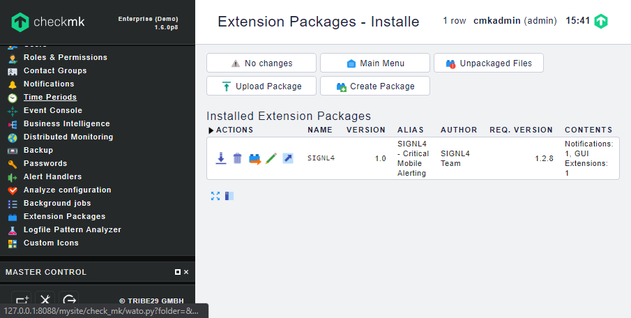

# SIGNL4 Plugin for checkmk

## Why SIGNL4

SIGNL4 is a mobile alert notification app for powerful alerting, alert management and mobile assignment of work items. It offers alerting via app push, SMS and voice calls including escalations, tracking, and duty scheduling.

Get the app at https://www.signl4.com.

Pairing checkmk with SIGNL4 can enhance your daily operations with an extension to your team wherever it is.

## Setup

In the following we describe the setup and configuration of the SIGNL4 Plugin for checkmk:

1. If not already done, sign up for your SIGNL4 account at https://www.signl4.com or directly from within your SIGNL4 app you can download from the Play Store or App Store.

2. Get the SIGNL4 plugin (SIGNL4-1.0.mkp) for checkmk from GitHub (https://github.com/signl4/signl4-integration-checkmk) or from checkmk exchange (https://checkmk.com/check_mk-exchange.php?exchange_search=signl4&sort_by=).

3. Upload the .mkp file in the checkmk portal under Extension Packages.

4. Create a Notification Rule and configure SIGNL4 Alerting as Notification Method. You would need to set the Team Secret to the team secret of your SIGNL4 team. This is the last part of your webhook URL (https://connect.signl4.com/webhook/<team-secret>). Also select one user in order to trigger the rule. Please note that the alert notification is sent to the SIGNL4 team according to the team secret, no matter what user(s) you have selected.

6. Now you can test it by simulating an alert in checkmk. When checkmk detects an issue, the information will be forwarded to your SIGNL4 team.

You can find the package on GitHub:
https://github.com/signl4/signl4-integration-checkmk
